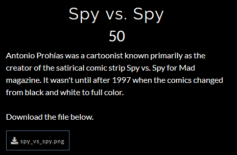
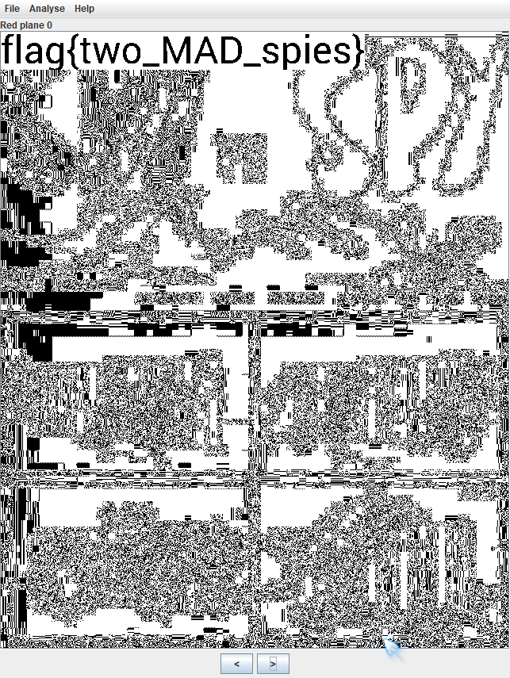
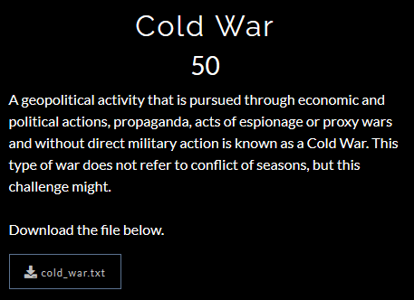
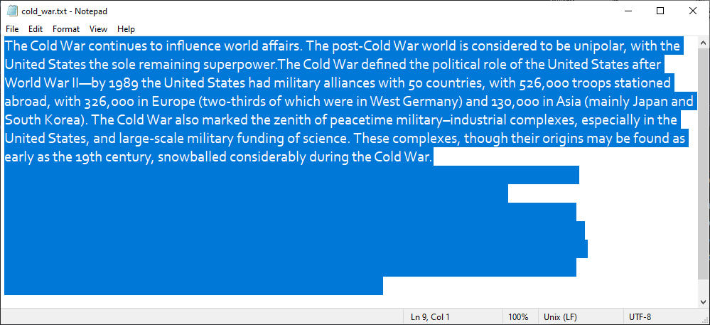
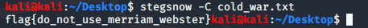
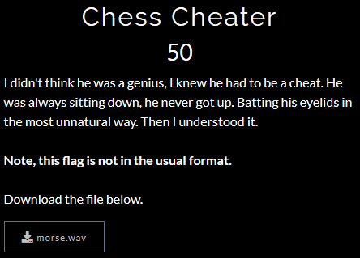
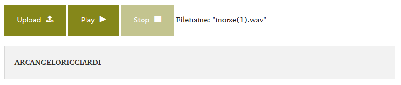
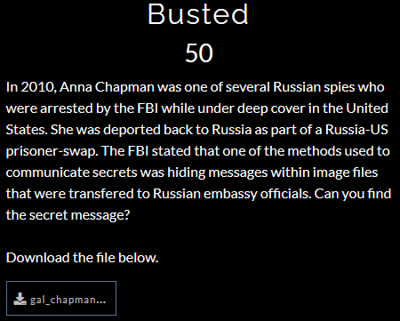
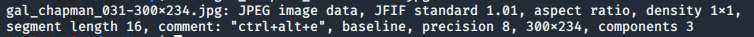
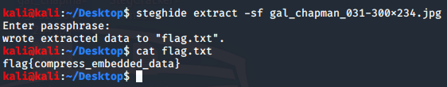

## Hacktivitycon CTF 2020 Write Up
Hacktivitycon CTF 2020 was the first ever real CTF that I participated in! Despite not managing to solve many of the challenges provided, it was a good learning experience for me and I definitely was able to gain a lot during and even after the event (credits to all the wonderful people that have been providing write ups).

Here are some of the challenges that I managed to solve (excluding Scavenger hunts)!
#### Steganography
- Spy vs Spy
- Cold War
- Chess Cheater
- Busted
- Unsubscribe
- Substitute Face

#### Miscellaneous
- Cat Cage

#### Warm Up Category
- Read the Rules (I will not be providing write up for this)
- Caeser Mirror
- Common Place
- InternetCattos (I think this was an accidental solve)
- Hexgedit
- Private Investigator
- Vencryption

Without further ado, let me begin breaking down my steps for each of the challenges (from top to bottom).

---

### Spy vs Spy
flag{two_MAD_spies}



Since this is a .png file, it is likely that there are some hidden texts in the color planes. Using ```stegsolve```, you can seee the flag clearly in Red plane 0.



### Cold War
flag{do_not_use_merriam_webster}



We are provided a .txt file. I opened it in Notepad, and decided to select all using ```Ctrl + A```. This revealed that there was a chunk of white space at the end of the text. This led me to think that perhaps it was whitespace steganography. 



Using ```stegsnow```, a tool to decode whitespace steganography, we were able to get the flag.



### Chess Cheater
flag: ARCANGELORICCIARDI (not in standard flag format)



This one was pretty simple. The file provided to us was titled morse.wav, therefore we can deduce that it was morse code. Using an online [morse code audio decoder](https://morsecode.world/international/decoder/audio-decoder-adaptive.html), we find out that the flag is ARCANGELORICCIARDI.



### Busted
flag{compress_embedded_data}



I first used the ```file``` command to inspect the .jpg file. This was the output of the file command. Notice that there is an interesting line of output ```comment: "ctrl+alt+e"```.



Since this is a .jpg file, it is likely that steghide would be able to help extract the flag. Assuming that the comment is the password for the file, I inputted the .jpg file into steghide and added the password which successfully retrieved the flag.



---