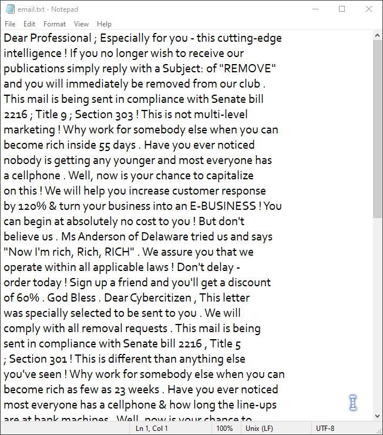

## Hacktivitycon CTF 2020 Write Up
Hacktivitycon CTF 2020 was the first ever real CTF that I participated in! Despite not managing to solve many of the challenges provided, it was a good learning experience for me and I definitely was able to gain a lot during and even after the event (credits to all the wonderful people that have been providing write ups).

Here are some of the challenges that I managed to solve (excluding Scavenger hunts)!
#### Steganography
- Spy vs Spy
- Cold War
- Chess Cheater
- Busted
- Unsubscribe

#### Miscellaneous
- Cat Cage

#### Warm Up Category
- Read the Rules (I will not be providing write up for this)
- Caeser Mirror
- Common Place
- InternetCattos (I think this was an accidental solve)
- Hexgedit
- Vencryption

Without further ado, let me begin breaking down my steps for each of the challenges (from top to bottom).

---
### Spy vs Spy
flag{two_MAD_spies}


Since this is a .png file, it is likely that there are some hidden texts in the color planes. Using ```stegsolve```, you can seee the flag clearly in Red plane 0.


### Cold War
flag{do_not_use_merriam_webster}


We are provided a .txt file. I opened it in Notepad, and decided to select all using ```Ctrl + A```. This revealed that there was a chunk of white space at the end of the text. This led me to think that perhaps it was whitespace steganography. 


Using ```stegsnow```, a tool to decode whitespace steganography, we were able to get the flag.


### Chess Cheater
flag: ARCANGELORICCIARDI (not in standard flag format)


This one was pretty simple. The file provided to us was titled morse.wav, therefore we can deduce that it was morse code. Using an online [morse code audio decoder](https://morsecode.world/international/decoder/audio-decoder-adaptive.html), we find out that the flag is ARCANGELORICCIARDI.


### Busted
flag{compress_embedded_data}


I first used the ```file``` command to inspect the .jpg file. This was the output of the file command. Notice that there is an interesting line of output ```comment: "ctrl+alt+e"```.


Since this is a .jpg file, it is likely that steghide would be able to help extract the flag. Assuming that the comment is the password for the file, I inputted the .jpg file into ```steghide``` and added the password which successfully retrieved the flag.


### Unsubscribe
flag{hidden_message_in_spam}


The hint suggests something about email spam. Opening up the email.txt file in notepad, we see that it is indeed, similar to spam email. 



Google shows that there is a type of cipher known as spam cipher! That is probably what we are looking for, therefore I used a [spam decoder](https://www.spammimic.com/decode.shtml) and pasted the text there. Sure enough, the flag was the output.


---

### Cat Cage
flag{thats_a_good_trick_heres_some_catnip}


When we have successfully gained the shell, the first think I did was to run ```ls```. There was only one file in the working directory called ```get_flag```. I used ```cat``` to read it and there was no flag (unfortunately, I forgot to take a screenshot here).

I did some digging around the machine and there was no other file that could potentially contain a flag. It had to be inside that file. That led me to think perhaps the flag was hidden inside the file. Using ```cat -v```, I was able to read the hidden characters and retrieve the flag.


---

### Caeser Mirror


### Common Place
flag{rfc5785_defines_yet_another_common_place}


Initially, I thought that the flag was perhaps hidden in the source code. I dug around, couldn't find anything. I even checked the JavaScript files to see if there was anything. I checked common places such as robots.txt, but my ventures yielded no information about the flag.

That's when I decided to take a closer look at the conversation. The usernames seemed random, but I decided to go through each one of them on Google to see if they have any specific meaning. When I hit ```rfc5785```, Bingo - I knew the flag was within my grasp!


I navigated to the /.well-known directory and sure enough, we were presented with the flag file!


### InternetCattos
flag{this_netcat_says_meow}

I think I may have accidentally solved this. All I did was open up the link in FireFox, and the flag was staring back at me. Apparently, according to a friend, Chrome was not able to view this. Somehow, FireFox has some magical powers ಠ_ಠ


### Hexgedit
flag{optical_hexadecimal_recognition_amirite}


I... Actually manually did this challenge. It was painful, but I managed to translate all the hex, only to realize that the flag was at the bottom (;﹏;)


### Vencryption
flag{sometimes_it_really_do_be_like_that_tho}


A quick ```file``` reveals that this is a vim encrypted file. Since we do not have any knowledge of what the password may be, I decided that perhaps brute force will be required. I managed to find a software to decrypt this known as ```vimdecrypt```. However, there are certain outdated Python modules within it which I removed on my own such as ```time.clock()``` and a progress bar. Once I managed to get the script working without it screaming errors at me, it spat out the flag along with the password of the file


---

And that's the end of my write up! Those were all the challenges I have completed. I had attempted a few more but never managed to complete them, though right after the end of the CTF I was scrambling around trying to find write ups for them. Here are the names of other challenges I have attempted:
- Private Investigator (Warm Up, I was stuck because I didn't add the new line!)
- Substitution Face (I knew it was Codemoji, but I couldn't find a way to decode it and didn't think of using Hex)
- Ladybug
- Bite (I totally flung the concept of Null Byte out of my brain)

All in all, this was an extremely rewarding experience for me. The entire CTF was very well organized and fun! Thanks to the team that created this CTF, and of course I will be participating in more in hopes to improve!

One day, I want to be able to attend a CTF like Hacktivity again and be able to clear 90% of all the challenges available. Till then, I'll keep trying my best (not to bang my head against my table)!

Thanks for reading and have a great time hacking ฅ•ω•ฅ